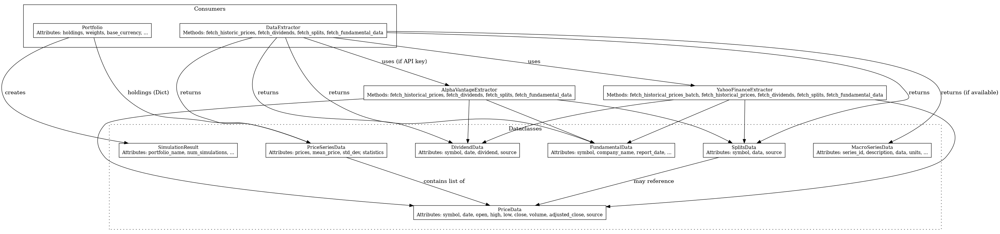

# Financial Market Data Toolkit

A comprehensive Python 3 toolkit for fetching, cleaning, and analyzing financial market data. Built with Object-Oriented Programming (OOP) principles, this toolkit now supports extracting, cleaning, and analyzing an expanded range of financial data, including stock splits, dividends, and fundamental data, among others.

## Features

- **Multi-API Data Extraction**: Fetch financial data from multiple sources (Yahoo Finance, Alpha Vantage)
- **Standardized Data Models**: Clean dataclass-based structures for price data, portfolios, stock splits, dividends, and fundamental data
- **Data Cleaning**: Comprehensive utilities for handling missing values, outliers, and data validation
- **Portfolio Simulation**: Monte Carlo simulation for risk analysis and portfolio optimization
- **Risk Metrics**: Calculate volatility, Sharpe ratio, VaR, CVaR, and maximum drawdown
- **Markdown Reporting**: Generate professional analysis reports in markdown format
- **Visualization**: Create publication-quality charts for price history, simulations, portfolios, and dividend/split analysis

## Installation

### Using Docker (Recommended)

1. Build the Docker image:

```bash
docker build -t financial-toolkit .
```

2. Run the Docker container:
Since the application store the results in the container in the reports folder then we need to mount a volume to access them from the host

```bash
docker run --rm -it -v $(pwd)/reports:/app/reports financial-toolkit
```

This will run the default example script (`examples/interactive_portfolio_analysis.py')

### Manual Installation

Make sure you have Python 3.8+ installed.

```bash
# Clone the repository
git clone https://github.com/CristianCamilo98/tarea_1.git
cd tarea_1

# Install dependencies
python -m venv venv
source venv/bin/activate
pip install -r requirements.txt
```

#### Using Alpha Vantage as a Data Source

If you want to use Alpha Vantage, you must obtain an API key:

1. Go to https://www.alphavantage.co/support/#api-key and request your free API key.
2. Create a file named `.env` in the project root directory with the following content:

    ```
    ALPHA_VANTAGE_API_KEY=your_api_key_here
    ```

Replace `your_api_key_here` with the key you received. This will allow the toolkit to fetch data from Alpha Vantage where required.

## Project Structure

```
tarea_1/
├── src/
│   └── financial_toolkit/
│       ├── __init__.py             # Package initializer
│       ├── data_models.py          # Dataclasses for financial data
│       ├── data_extractor.py       # Multi-API data fetching
│       ├── alpha_vantage.py        # Alpha Vantage API wrapper
│       ├── yahoo_finance.py        # Yahoo Finance API wrapper
│       └── models/                 # Financial data models
├── examples/
│   ├── complete_analysis.py        # Complete workflow example
│   ├── portfolio_analysis.py       # Portfolio analysis example
│   └── interactive_portfolio_analysis.py  # Interactive CLI tool
├── Dockerfile                      # Docker configuration
├── diagram.dot                     # Class diagram (DOT format)
├── diagrama.png                    # Generated class diagram image
├── requirements.txt                # Dependency list
├── README.md                       # Project documentation
├── QUICKSTART.md                   # Quickstart guide
├── FEATURES.md                     # Feature overview
└── LICENSE                         # License file
```

## Class Diagram

A class diagram illustrating the main dependencies and structure of the toolkit is provided. You can generate it from the DOT file as follows:

```bash
dot -Tpng diagram.dot -o diagrama.png
```


